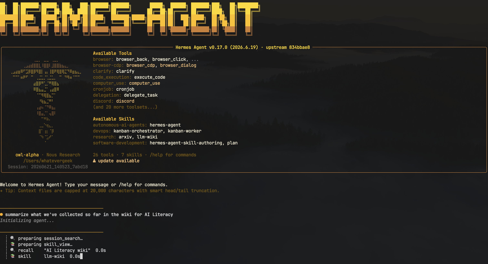
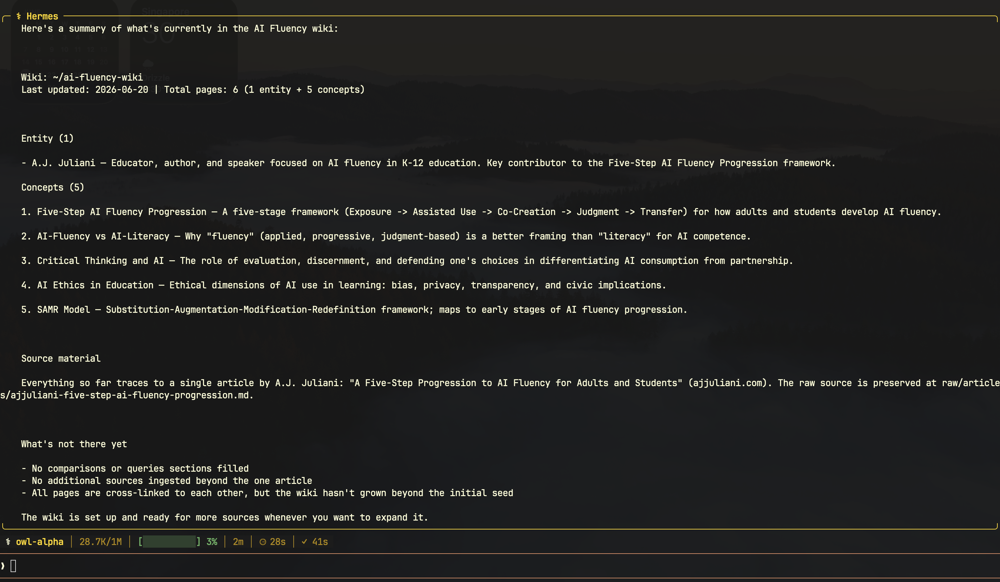
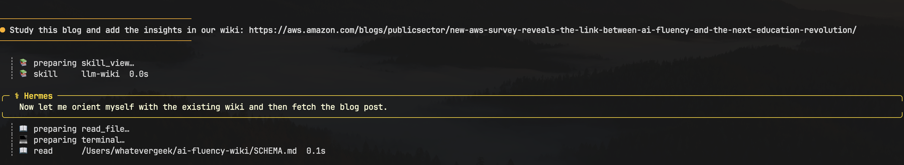
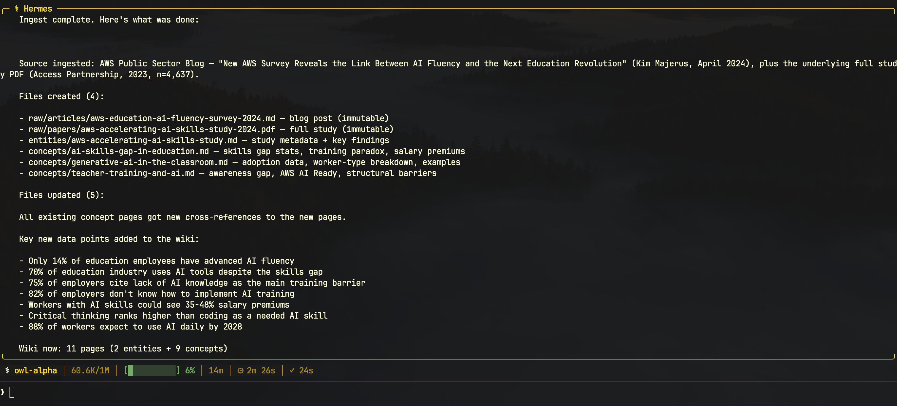
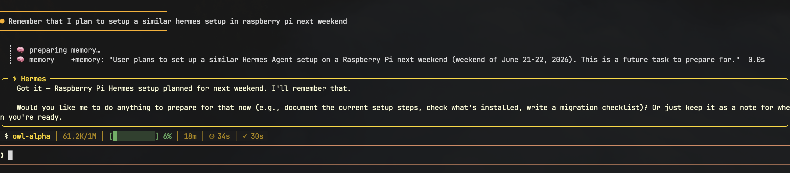
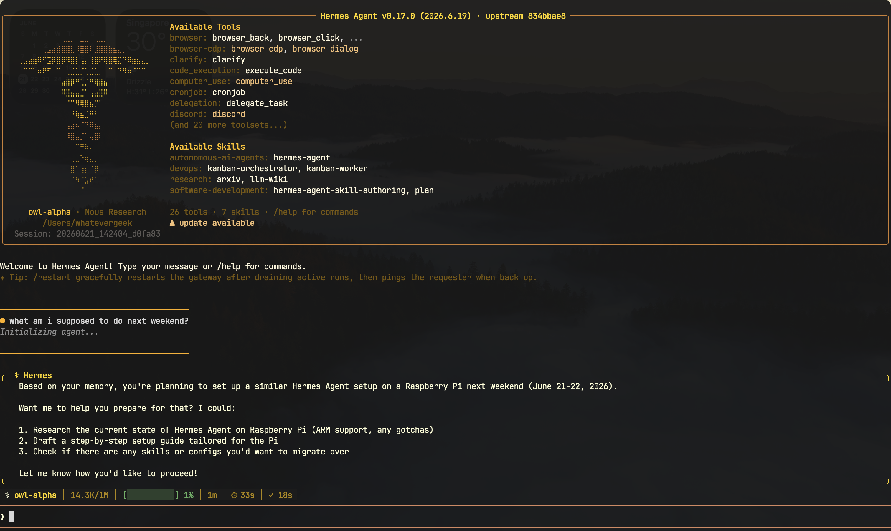

# Hermes Workshop Submission

This repository documents my Hermes agent work for the AI Ready ASEAN in-depth AI Literacy Certification submission.

## Workshop Context

This submission is connected to the PyCon Singapore Hermes Agent / AI Ready ASEAN workshop pathway:

- [Build Your Hermes Agent-powered Second Brain](https://pycon.sg/agent/) - PyCon Singapore's Hermes Agent workshop page. The workshop frames Hermes as a personal learning assistant or "second brain" that can remember across sessions, turn solved work into reusable skills, and grow through continued use. The PyCon Singapore site navigation also exposes this page as [AI Agent Workshop](https://pycon.sg/aiagent.html).
- [AI Ready ASEAN at PyCon Singapore](https://pycon.sg/aira.html) - PyCon Singapore's AI Ready ASEAN certification page. It describes the in-depth AI literacy certification programme run with AI Singapore and ASEAN Foundation, with support from Google.org, and explains the hands-on focus on AI usage, implementation, prompting, evaluation, ethics, privacy, and security.

## Local Hermes Setup Summary

My Hermes environment is configured locally under `~/.hermes`. That private directory is not published in this repository because it can contain authentication files, environment variables, logs, session history, pasted content, caches, and other personal data.

For the public submission, this README only summarizes the setup at a safe level:

- Hermes is installed locally with its agent source and runtime files under `~/.hermes/hermes-agent`.
- The setup includes a local configuration file, model/provider caches, gateway state, session state, logs, and a SQLite state database.
- The setup has a skills directory with curated skill areas such as research, GitHub, note-taking, productivity, software development, data science, and autonomous AI agents.
- The setup includes a `~/.hermes/memories` area intended for persisted memory data.
- Sensitive files such as `.env`, `auth.json`, logs, raw sessions, pastes, and database files are intentionally excluded from this public repository.

The screenshots in this repository are the shareable evidence layer: they show the agent in use, the teaching or curation step, and a later separate session where Hermes remembers earlier context.

## Evidence Overview

The screenshots below show three things required by the submission prompt:

- Hermes running and responding on my chosen topic: AI literacy / AI fluency.
- Hermes being taught and curated through an AI fluency wiki workflow.
- Hermes remembering information from an earlier session in a later, separate session.

## 1. Hermes Running on AI Literacy

These screenshots show Hermes starting with the available tools and skills, then responding to a request to summarize the AI Fluency wiki.

## 2. Hermes Taught and Curated on the Topic

These screenshots show Hermes using the `llm-wiki` skill to ingest and curate new AI fluency source material into the local wiki.

## 3. Hermes Memory Across Separate Sessions

These screenshots show a memory note being saved in one session, then recalled in a later separate session.

## Submission Checklist

- Shows Hermes running and responding on AI literacy.
- Shows topic-specific teaching or curation.
- Shows memory carried from an earlier session into a later separate session.
